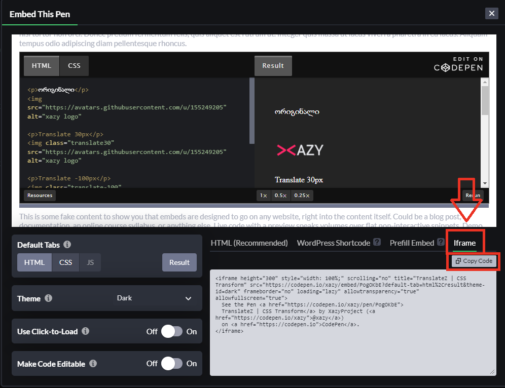

# XAZY კონტრიბუცია

## სარჩევი

- [მასალის სტრუქტურა](#მასალის-სტრუქტურა)
  - [სათაურები](#სათაურები)
  - [სურათები გაკვეთილში](#სურათები-გაკვეთილში)
  - [კოდი ტექსტში](#კოდი-ტექსტში)
  - [კოდის მაგალითები](#კოდის-მაგალითები)
  - [CodePen](#CodePen)
  - [სიების ჩასმა](#სიების-ჩასმა)
  - [ლინკები](#ლინკები)
  - [შორთქათები](#შორთქათები)
- [გაკვეთილის სტრუქტურა](#გაკვეთილის-სტრუქტურა)
- [კონტრიბუცია](#კონტრიბუცია)
  - [მუშაობა](#მუშაობა)
  - [Pull Request-ის გახსნა](#Pull-Request-ის-გახსნა)


## მასალის სტრუქტურა

იმისათვის, რომ მასალაზე მოახდინოთ რაიმე სახის ცვლილება ან დამატება, აუცილებელია გაითვალისწინოთ, როგორ იწერება Markdown ფაილში მასალა.

### სათაურები

ლექციის სახელი აუცილებელია ეწეროს ფაილის თავში h1-ით, ანუ Markdown-ის ენაზე `#`-ით. მაგალითი:

```markdown
# Flexbox შესავალი
```

Markdown ამას გადაიყვანს HTML-ში, როგორც:

```html
<h1>Flexbox შესავალი</h1>
```

გაკვეთილის თავები ჩასმულია h2-ში, ანუ `##`-ში, რომლებიც გაკვეთილის ნავიგაციაში მოხვდებიან. მაგალითი:

```markdown
## განლაგება
```

Markdown ამას გადაიყვანს HTML-ში, როგორც:

```html
<h2>Flexbox შესავალი</h2>
```

ხოლო თავად გაკვეთილის თავში არსებული ქვესათაური იწერება h3-ში, ანუ `###`.

### სურათები გაკვეთილში

თუ გსურთ გაკვეთილში სურათის დამატება, უნდა შექმნათ ფოლდერი იმ სივრცეში, სადაც თავად ეს ლექცია იმყოფება. ამ ფოლდერის სათაური უნდა იყოს გაკვეთილის სათაური და ბოლოში -imgs:


ხოლო, თავად ლექციაში სურათის დამატება Markdown-ში, შეგიძლიათ ასე:

```markdown

```

პირველად იწერება alt ატრიბუტი, ხოლო ფრჩხილებში ფოტოს მისამართი.

### კოდი ტექსტში

იმისათვის, რომ ტექსტში დაწეროთ კოდი, ან რაიმე ტერმინი, ვიყენებთ Template literals (``). 
მასში ჩაწერილი ტექსტი `გამოჩნდება ასე`.

Markdown-ში ჩაწერის მაგალითი:

```markdown
არის 6 სახის სათაური, რომელიც იწყება `<h1>` დან `<h6>` ის ჩათვლით. თითო ციფრი აღნიშნავს სათაურის ზომას. 
```

ეს გამოჩნდება ასე:


### კოდის მაგალითები

კოდის მაგალითების დასაწერად Markdown-ს აქვს ფუნქცია, რომლის მითითების შემდეგ სვამს კოდს დივში, შესაბამისი ენის აღმნიშნავ კლასში. თქვენ მხოლოდ გიწევთ ენის მითითება, რომლის კოდსაც წერთ. Markdown-ში ჩაწერილი HTML-ს მაგალითი:


html-ს ნაცვლად ჩავწერთ იმ ენას, რომელსაც ვიყენებთ, მაგ: css, javascrpt და ა.შ.

### CodePen

CodePen-ის მაგალითების ჩასმისას, აუცილებელია ჩასვათ `<iframe>`-ს გამოყენებით:



### სიების ჩასმა

დანომრილი სიების ჩასაწერად გვჭირდება უბრალოდ დანომვრა:

```markdown
1. პირველი
2. მეორე
3. მესამე
4. მეოთხე
  1. მეოთხეს შიდა სია
  2. მეორე
5. მეხუთე
```

ხოლო დაუნომრავი სიებისთვის:

```markdown
- პირველი
- მეორე
- მესამე
- მეოთხე
  - მეოთხეს შიდა სია
  - მეორე
- მეხუთე
```

### ლინკები

ლინკების ჩასმა markdown-ში ხდება ასე:

```markdown
[ტექსტი, რომელზეც ლინკია](www.xazy.ge)
```

### შორთქათები

იმისათვის, რომ შორთქათის შესახებ დაწეროთ, ანუ კლავიატურის რა ღილაკზე დაჭერის კომბინაციით რა ხდება, უნდა ჩასვათ `<kbd>Ctrl</kbd> + <kbd>Shift</kbd> + <kbd>Del</kbd> `-ში, რომელიც გამოჩნდება ასე: <kbd>Ctrl</kbd> + <kbd>Shift</kbd> + <kbd>Del</kbd> 

## გაკვეთილის სტრუქტურა

```markdown
# გაკვეთილის სათაური

## შესავალი

შესავალი ყველა ლექციისთვის აუცილებელია, აქ ზოგადად შეეხებით გაკვეთილის თემებს.

## გაკვეთილის მიმოხილვა

ეს სექციაც აუცილებელია, დაუნომრავი სიით ჩამოწერთ რას ვისწავლით გაკვეთილში.

- ვისწავლით ამას
- ვისწავლით იმას

<!-- აქ ვწერთ მთლიან გაკვეთილს -->

## დავალება

<div className="homework">

დავალების დაწერა არ არის სავალდებულო, ხოლო არსებობის შემთხვევაში, უნდა ჩავსვათ ასეთ დივში: <div className="homework"></div>

</div>

## დამატებითი რესურსები 

დამატებითი რესურსები არ არის აუცილებელი, მაგრამ უმჯობესია თუ იქნება დამატებითი სტატიები, ვიდეოები და ა.შ.

```

## კონტრიბუცია

1. პირველ რიგში უნდა და-fork-ოთ რეპოზიტორია, რომელზეც გინდათ მუშაობა, თქვენს გითჰაბ ექაუნთზე. თუ არ იცით როგორ, გადახედეთ თავად გითჰაბის დოკუმენტაციას [რეპოზიტორიის დაფორკვაზე](https://docs.github.com/en/get-started/quickstart/fork-a-repo).

2. დაკლონეთ დაფორკილი რეპოზიტორია თქვენს კომპიუტერში მოცემული ბრძანებებიდან ერთ-ერთის გამოყენებით. დარწმუნდით, რომ `<username>` ადგილას ჩაწერთ თქვენს რეალურ გითჰაბის სახელს და `<repo name>`-ში რეალურ რეპოზიტორიის სახელს. თუ არ იცით, გადახედეთ გითჰაბის დოკუმენტაციას [რეპოზიტორიის დაკლონვაზე](https://docs.github.com/en/repositories/creating-and-managing-repositories/cloning-a-repository).

```bash
# თუ გსურთ SHH-თი:
git clone git@github.com:<username>/<repo name>.git
# თუ გსურთ SHH-თი:
git clone https://github.com/<your username>/<repo name>.git

# მაგალითი:
git clone git@github.com:lukaoes/masala.git
```

3. `cd`-ს გამოყენებით შედით უკვე ლოკალურად ჩაწერილ რეპოზიტორიის ფოლდერში და დააყენეთ upstream remote, რათა სინქრონში იყოს XAZY-ს ორიგინალ რეპოზიტორიასთან. `<repo name>` უნდა შეცვალოთ იმით, რაც გამოიყენეთ დაკლონვისას წინა ნაბიჯში.

```bash
# თუ გსურთ SHH-თი:
git remote add upstream git@github.com:XazyProject/<repo name>.git
# თუ გსურთ SHH-თი:
git remote add upstream https://github.com/XazyProject/<repo name>.git

# მაგალითი:
git remote add upstream https://github.com/TheOdinProject/masala.git
```

### მუშაობა

როდესაც უკვე დაფორკეთ რეპოზიტორია, დაკლონეთ და დააყენეთ upstream remote, უკვე შეგიძლიათ დაიწყოთ მუშაობა:

1. შექმენით ახალი ბრენჩი. ბრენჩის სახელს თქვენ იფიქრებთ. ჩაანაცვლეთ `<branch name>` რეალური ბრენჩის სახელით, რაც, დაახლოებით ბრენჩის გახსნის მიზეზი იქნება:

```bash
git checkout -b <branch name>

# მაგალითები:
git checkout -b fix_mistakes_in_flexbox
git checkout -b add_additional_resources_in_css_shesavali
git checkout -b change_link_in_css_chonchxi
```

2. დაამატეთ ქომითები მუშაობასთან ერთად, `<commit message>`-ში ჩაწერეთ რეალური ქომითის მესიჯი:

```bash
git commit -m "<commit message>"

# მაგალითი:
git commit -m "Update name of css chonchxi"
```

4. და-push-ეთ თქვენი ბრენჩი თქვენს დაფორკილ რეპოზიტორიაზე, `<branch name>`-ს ადგილას ჩაწერეთ თვენი რეალური ბრენჩის სახელი:

```bash
git push origin <branch name>

# მაგალითი:
git push origin fix_mistakes_in_flexbox
```

### Pull Request-ის გახსნა

1. ცვლილებების ფუშის შემდეგ, გადადით თქვენს დაფორკილ რეპოზიტორიაზე გითჰაბზე და დააჭირე "Compare & pull request" ღილაკს. დარწმუნდით, რომ სწორი ბრენჩია არჩეული.
  - თუ ამ ღილაკს ვერ ხედავთ, შეგიძლიათ დააჭიროთ ბრენჩის ჩამოსაშლელ მენიუს და აირჩიოთ ბრენჩი, რომელზეც ეს ცვლილებები შეფუშეთ ლოკალური კლონიდან:

  

  - მას შემდეგ რაც სწორ ბრენჩს აირჩევთ გითჰაბზე, დააჭირეთ "Contribute" ჩამოსაშლელს და დააჭირეთ "Open pull request" ღილაკს.

2. "მომვლელების" მიერ დადადსტურების შემთხვევაში თქვენი ცვლილებები მთავარ რეპოზიტორიაში გადავა.
  
  - შესაძლოა დაგიწეროთ, თუ რა ცვლილება განახორციელოთ ამ გამოგზავნილ ცვლილებებში, ამიტომ აუცილებელია შეამოწმოთ კომენტარები და თხოვნის შემთხვევაში შეცვალოთ მითითებები.